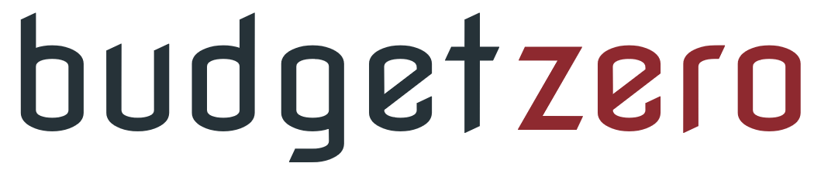
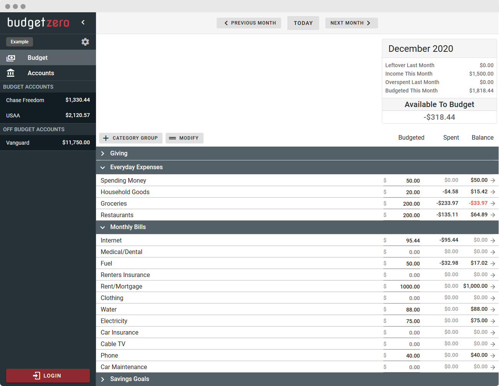

# <a href="https://app.budgetzero.io"><p align="center"></p>
[](https://app.netlify.com/sites/budgetzero/deploys)


  
budgetzero is a free, open-source, privacy-friendly, offline-first budgeting system.  

Use it now at [budgetzero.io](https://app.budgetzero.io) or self-host on your own server. Zero ads, zero trackers, just budgeting.



:warning: budgetzero is under active development and considered an alpha version. You may encounter significant bugs and breaking changes. Feel free to file an issue! :warning:

# Features
:heavy_check_mark: Zero-based 'envelope' budgeting   
:heavy_check_mark: Offline-first storage. NOTE: All data is stored in the browser and may be lost if you clear the browser's data.  
:heavy_check_mark: Import Transactions (OFX, QFX, CSV)  
:heavy_check_mark: Carry negative balances into next month  

# :warning: Known Issues (being worked on)
- UI Inconsistencies (pop-up boxes, colors, etc)
- Performance not tested for extremely large budgets (thousands of transactions)
- Transfer transactions work but may be a bit buggy
- Find a bug? Please [file an issue!](../../issues)


# Roadmap
- [ ] Reports
- [ ] Cloud Sync through budgetzero.io (coming soon)
  - **_Interested in Cloud Sync?_** [Sign up to be notified when available!](https://app.budgetzero.io/login)
- [ ] Self-hosted sync server (coming soon)
- [ ] Cross-platform desktop applications (Windows, Mac, Linux)
- [ ] Multi-month view
- [ ] Payee management

# Getting Started
There's multiple ways to use budgetzero.
1. On the official [app.budgetzero.io](https://app.budgetzero.io) page.
2. Installing the desktop app (Windows or Mac). [Download here](https://github.com/budgetzero/budgetzero/releases/latest)
3. Self host the web app. You can either deploy the docker image (recommended) or build and host the static files on your own webserver. See deployment section below for more details. 

# Deployment
## Docker 
```
docker pull budgetzero/budgetzero:latest
```
Then run with 
```
docker run -d -p <desired_port>:8080 --name budgetzero budgetzero/budgetzero
```
Example:
```
docker run -d -p 8080:8080 --name budgetzero budgetzero/budgetzero
```
Your budgetzero instance is now running at <docker_IP>:<desired_port>

## Manual Deployment
You can also build the static files and host on any webserver.
```
npm install
npm run build
```
The files will be built into the dist/ folder and can be hosted anywhere.


# Development
## Pull Requests

Good pull requests (patches, improvements, new features) are a greatly appreciated.

Please ask first before embarking on any significant pull request (e.g. implementing features, refactoring code), otherwise, you risk spending a lot of time working on something that might not get accepted or is already in development.

## Dev Setup
```
npm install
```

### To start a development web server:
```
npm run serve
```

### Run tests
Run all tests once:
```
npm run test:unit
```

Run all tests and re-run if files change:  
```
npm run test-watch:unit
```

Run with debugger (chrome://inspect)
```
node --inspect node_modules/.bin/jest --runInBand tests/unit/Transactions.spec.js    
```

